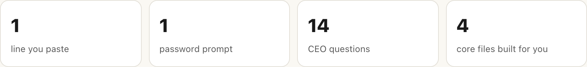
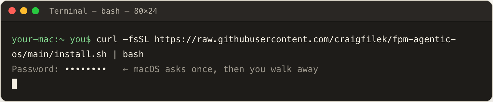
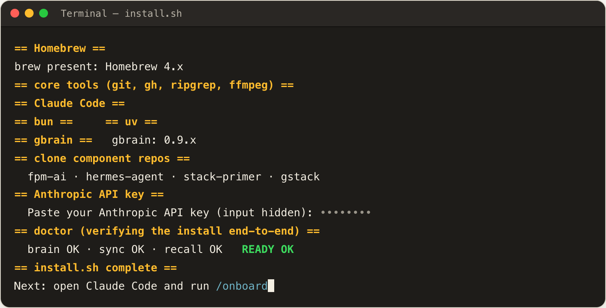
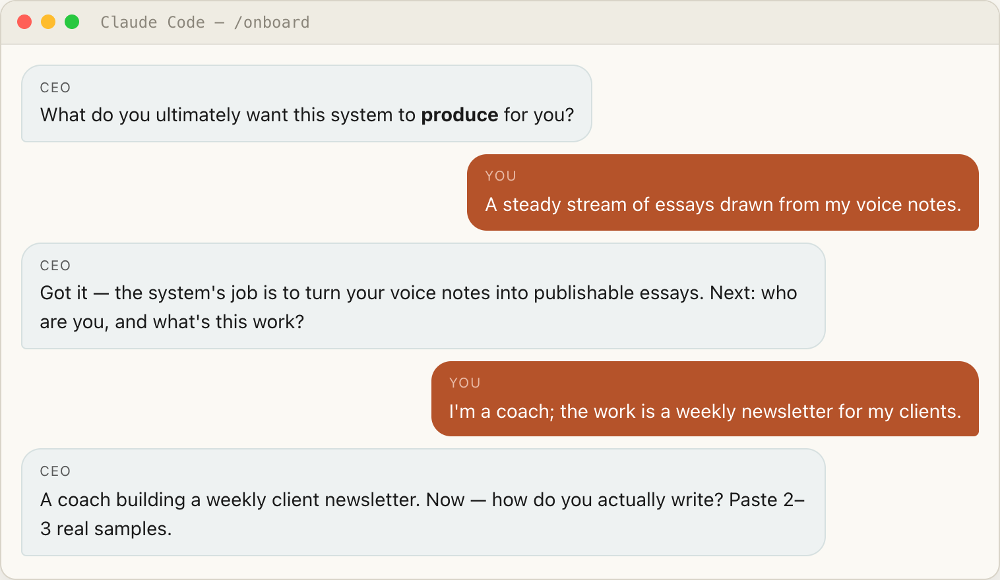
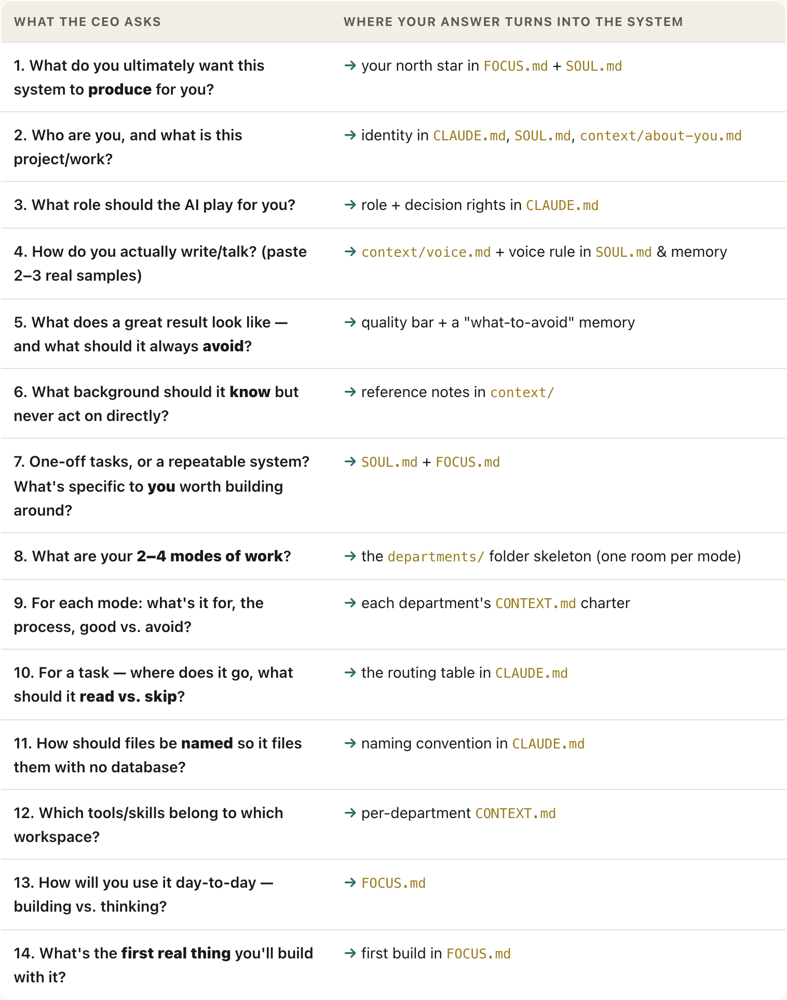
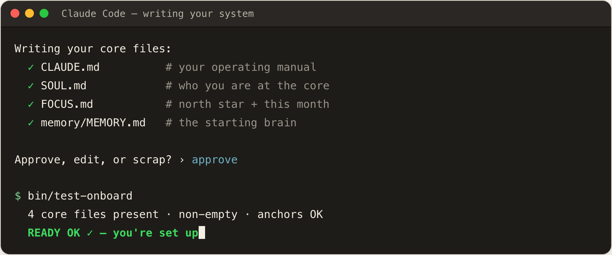
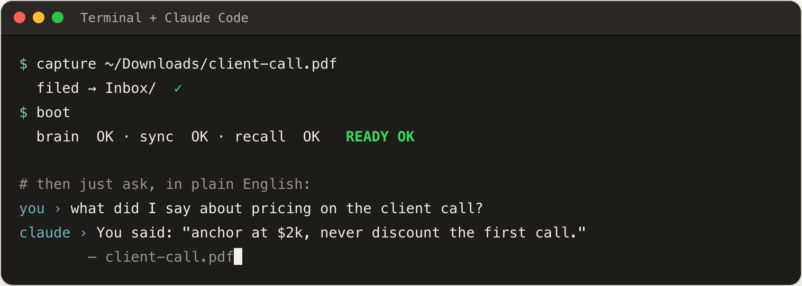
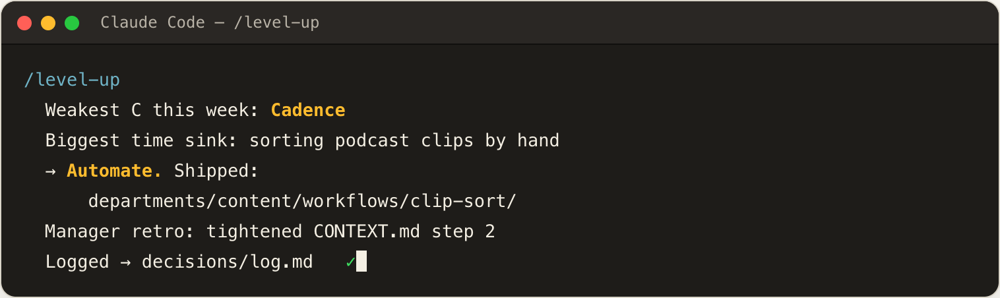

# fpm-agentic-os

**Your own AI second brain + assistant, on your own Mac.** It captures anything you
throw at it, remembers it, and hands it back in your own cited words. It **sets itself
up** from a short interview and **grows itself** one workflow a week. Start
featherweight; add the heavy engine only when you want it.

Who it's for: **anyone with a Mac** who wants a private, local assistant that
remembers their stuff — no servers, no lock-in. You don't need to know how to code.

What you run: clone the repo and run `/onboard` in Claude Code (Tier 0, below).
Or paste the one-line installer for the full engine (Tier 1).

🗺️ **[See the whole system as a live flowchart →](https://craigfilek.github.io/fpm-agentic-os/rig-map.html)**
An interactive map of every piece and how they wire together.

🚶 **[Walk through the setup, step by step →](https://craigfilek.github.io/fpm-agentic-os/journey.html)**
What you'll see on your screen at each stage — paste one line, the CEO interview, then the two daily verbs.

⚠️ **Early preview.** Shared openly, but not yet battle-tested on a fresh machine.
The one-line installer's OS-level steps (Homebrew, Claude Code) still need a
real first run by someone other than the author. The Tier 0 path below is the safe,
proven place to start. Expect rough edges and read before you run.

## ⚡ Start here — Tier 0 (15 minutes, nothing to install)

If you have **Claude Code**, this is the whole start:

1. Clone this repo and open the folder in Claude Code.
2. Run **`/onboard`** — a short interview. It fills your operating manual + `context/`
   folder so the system knows who it works for.
3. Use it. Each week, run **`/level-up`** — it ships one new workflow and improves an
   existing one. The system builds itself by accretion.

No runtimes, no API keys beyond Claude Code, nothing that can break. This is the door.

## ⬆️ Tier 1 — add the engine (when you want real memory + automation)

When you want it to *remember everything and recall by meaning*, capture from anywhere,
and message you on a schedule — install the engine (gbrain + the capture belt + Hermes):

```bash
curl -fsSL https://raw.githubusercontent.com/craigfilek/fpm-agentic-os/main/install.sh | bash
```

One Mac-password prompt, an Anthropic key (free at
[console.anthropic.com/settings/keys](https://console.anthropic.com/settings/keys)), ~30 min.
Everything from Tier 0 keeps working — this just adds power under it. See [INSTALL.md](INSTALL.md).

---

## What setup actually feels like

One pasted line turns a blank Mac into a system that knows who you are. Total time to
"alive" is about **45 minutes** — and you're only *present* for about **15** of them.
Here's exactly what you'll see on your screen at each stage.



> 🚶 Prefer the interactive version? The full styled walkthrough is at
> **[craigfilek.github.io/fpm-agentic-os/journey.html](https://craigfilek.github.io/fpm-agentic-os/journey.html)**.

### 1. Paste one line · ~30 seconds of your time

You open the Terminal app and paste a single command. macOS asks for your Mac password
**once** — the same prompt you see installing any app — then you walk away.



### 2. Walk away · ~30 minutes · fully automatic

Hands-off. The installer lays down the whole engine in order — Homebrew, the language
runtimes (Bun, uv), the helper tools, Claude Code, the component repos, and **gbrain**
(your local memory). It collects your API key with a *hidden* prompt, wires everything
together, then runs a doctor check to prove the install end-to-end.



### 3. Meet your CEO · ~15 minutes · the only part you actively do

You come back to the **CEO interview**. It talks like a sharp 11th-grader, asks **one
question at a time**, and reflects each answer back in a sentence.



Every answer becomes part of your system. The 14 questions map cleanly onto the files
they build:



### 4. Your answers become the system · ~1–2 minutes

The CEO writes your words (lightly cleaned, never paraphrased) into the **four core
files** and seeds your memory, then asks **"Approve, edit, or scrap?"** — nothing
finalizes until you say so. Then it proves it: `bin/test-onboard` goes green.



> Your answers stay yours: everything the CEO writes is git-ignored by the kit, so your
> personal files never ship even if you push the repo.

### 5. Day one: two verbs

The whole system runs on **CAPTURE** and **RECALL**. File anything in; ask for it back
in plain English and get your own words, cited to the source.



### 6. It grows itself: `/level-up`

Run it weekly. Each run ships **one** new workflow and improves **one** existing one —
the system accrues capability one piece at a time, never an org chart drawn up front.



---

## How it works

A **capture → recall** production line. Raw notes enter on the left and turn into
Markdown. They land in your Obsidian vault (the source of truth), where gbrain (the
searchable catalog) indexes them. An AI agent picks them back out on request — in your
own cited words.

> **See it as a flowchart:** the [live interactive map](https://craigfilek.github.io/fpm-agentic-os/rig-map.html)
> shows the whole system, and [`how-it-works.html`](how-it-works.html) is the shop-floor
> diagram (intake → process → store → retrieve, with the health "andon" board).

The one idea that unlocks it: **Obsidian = the books (your content, the truth); gbrain = the
card catalog (an index that points at the books).** Delete the catalog and your brain
stays whole — you just re-scan the books.

## How it grows itself

You never draw an org chart. You run **`/level-up`** weekly:

1. It finds the one thing that cost you the most time, and scopes a workflow to handle it.
2. It ships that workflow into a **department** (`departments/sales/`, `ops/`, `content/`…),
   creating the department if it's new.
3. That department's **manager** runs a retro on its own workflows — reads what actually
   happened, and applies one improvement. The system gets better on its own.

Departments are folders; managers are a charter + a retro (not a swarm of always-on bots).
It grows by accretion — one workflow at a time. See [`departments/README.md`](departments/README.md).

## What Tier 1 installs

Homebrew · git/gh/ripgrep/ffmpeg · Claude Code · Bun + uv runtimes · markitdown + yt-dlp
(the capture front door) · **gbrain** (your local brain index) · the component repos
(fpm-ai, Hermes, stack-primer, gStack) · and the `bin/` tools (`boot`, `capture`,
`instagram-station`). Full detail: **[INSTALL.md](INSTALL.md)**.

## The keys you'll need

| Key | Needed? | Powers |
|---|---|---|
| Anthropic | **Required** | the agent itself |
| ZeroEntropy | Recommended | semantic recall (keyword works without it) |
| Telegram bot | Optional | talk to it from your phone |

Where to get each + how it's stored: **[KEYS.md](KEYS.md)**.

## Day one

```
boot         # the green health lamp — is the brain live?
capture <file-or-url>     # file anything into the brain
```
Then just ask your agent: *"what did I save about ___?"*

## Layout & portability

Repos live **flat** at `~/<repo>` (`~/fpm-agentic-os`, `~/gstack`, `~/hermes-agent`, …).
`install.sh` owns that layout — **don't nest repos into folders.** The wiring (skill
symlinks, the MCP config, Hermes' editable install, `$PATH`) hardcodes these paths, so
moving a repo dangles all of it.

Portability means *"clone onto a fresh Mac, run the installer, it works"* — **not**
*"drag folders around."* If you ever need to relocate, re-run the installer.

Run `./setup` any time the wiring feels off. It's idempotent: it re-links `bin/` tools
into `~/.local/bin` as **symlinks** (never copies, so they can't drift). It also writes
`.env.example` and runs a `doctor` check — all skill symlinks resolve, Hermes up.

Note that **`~/hermes-agent` is load-bearing**: a launchd KeepAlive service with an
editable pip install pinning absolute paths. Leave it at root. Its plist pins a specific
Homebrew `node` version — swap that to the unversioned `/opt/homebrew/bin` path before
a `brew upgrade node`.

## More

Maps and skills:

- **[Live interactive map](https://craigfilek.github.io/fpm-agentic-os/rig-map.html)** — the whole system as a flowchart.
- **`/onboard`** & **`/level-up`** — the two skills that set it up and grow it (`.claude/skills/`).
- **[how-it-works.html](how-it-works.html)** — the shop-floor diagram of the whole machine.

Setup references:

- **[INSTALL.md](INSTALL.md)** — what the Tier-1 installer does, step by step.
- **[KEYS.md](KEYS.md)** — every key, where to get it, where it's stored.
- **[AGENTS.md](AGENTS.md)** — the runbook an AI agent follows to set you up.

Design and growth:

- **[DESIGN.md](DESIGN.md)** — why it's built this way.
- **[departments/README.md](departments/README.md)** — how the system grows itself.
- **[OBSIDIAN-MIGRATION.md](OBSIDIAN-MIGRATION.md)** — build your vault + migrate Evernote / Apple Notes / Voice Memos.

## Credits

Built with Claude (Anthropic). Borrows the **3 Ms + Four Cs** frameworks and the
`/onboard` → `/level-up` ritual shape from **Nate Herk's AIS-OS** (the easy-onboarding
model we mirror), plus gStack (Garry Tan), ICM (Jake Van Clief), and PARA (Tiago Forte).
See DESIGN.md.
